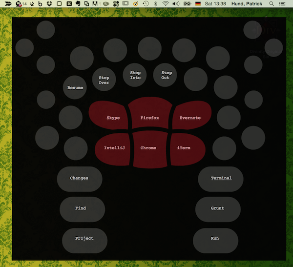

# Fang Growl Style

A Growl style for displaying a cheat sheet of key bindings for an Ideazon Fang gaming keyboard.

This is a little hack project of [mine](http://www.twitter.com/pahund): I use an old (but good!) gaming keyboard
called Ideazon Fang in conjunction with [Karabiner](https://pqrs.org/osx/karabiner/) and
[Keyboard Maestro](http://www.keyboardmaestro.com/) to control my Mac (starting and switching to applications, stepping
through code while debugging, etc.).

While this works great, I tend to forget sometimes which key I assigned to which KM macro. At first, I just used a sticky
note for that, but that's not really the Nerd Way<small>TM</small> to do it, is it?

So I came up with this: assign one of the Fang's buttons to a Keyboard Maestro macro that displays a
[Growl](http://growl.info/) notification with a custom style that has the keyboard layout of the Fang controller
as a background image.

This way, I can display a kind of cheat sheet with my key bindings that pops up every time I tap that special button
on my Fang.

## How to Install

Theoretically, after you cloned this repo, you can just double-click the [Fang.growlStyle](Fang.growlStyle) directory
and Growl will install the style (a.k.a. plugin) for you.

For me, this didn't work, though, so I wound up copying the dir to my `/Applications/Growl.app/Contents/PlugIns/`
directory (see [install.sh](install.sh)).

Next step: restart Growl, then go to *Growl Preferences > Displays > Add Config* and select "Fang". Then go to tab
"Applications" and assign the Fang display style to Keyboard Maestro Growl Action.

## Setting up Keyboard Maestro

In Keyboard Maestro, create a new macro that is triggered by device key and assign it to a key on the Fang.

Make this macro execute a Fang action and put the labels you want to put on the Fang keyboard layout in the Growl
notification box in the action's message field.

This is a bit tricky and takes some trial and error: you move your labels to the correct position in the notification
box by adding lots of new lines and spaces.

_Important_: Give the Fang action the "magic" title `fang-cheat-sheet` &mdash; otherwise a plain notification layout
is used instead of the Fang keyboard layout background.

## Normal Notifications in Keyboard Maestro

If you want to trigger a normal Growl notification from KM without Fang keyboard layout background, simply use
any other title than `fang-cheat-sheet` for your Growl notification action.

I find it lame that Keyboard Maestro does not allow you to use custom icons for your notification, so I made the
layout of the non-Fang notification so that the first line of the notification message's body text is used as icon.

This way, you can put an Emoji in the first line (e.g. a ringing bell 🔔 for alerts or a pile of poo 💩 if something
goes awry).

Remember that you can trigger the Emoji palette in Mac OS X with the key combination Control+Command+Space.

If you don't want an Emoji icon, leave the first line of your message body blank, otherwise it will look quite broken.
